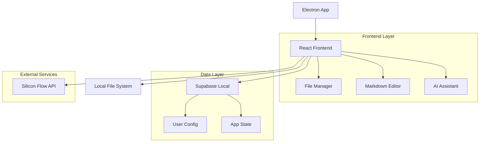
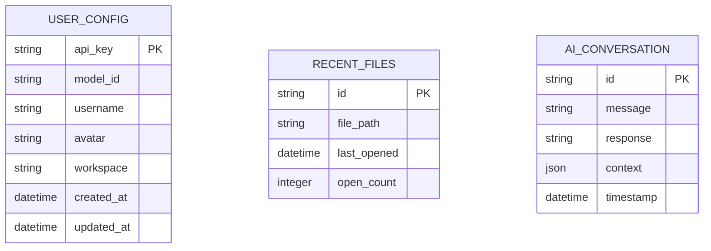

## 1. 架构设计



## 2. 技术描述
- **前端框架**: Electron + React@18 + TypeScript
- **UI库**: TailwindCSS + HeadlessUI
- **编辑器**: CodeMirror@6（支持Markdown）
- **状态管理**: Zustand
- **文件系统**: Node.js fs API（通过Electron）
- **数据库**: Supabase（本地嵌入模式）
- **AI服务**: Silicon Flow API（用户配置）

## 3. 路由定义
| 路由 | 用途 |
|------|------|
| / | 主界面，三栏式布局 |
| /settings | 设置面板，用户配置 |

## 4. API定义

### 4.1 文件系统API
```typescript
// 文件操作接口
interface FileSystemAPI {
  // 工作区管理
  selectWorkspace(): Promise<string>
  getWorkspaceFiles(path: string): Promise<FileNode[]>
  
  // 文件操作
  createFile(path: string, content: string): Promise<void>
  readFile(path: string): Promise<string>
  writeFile(path: string, content: string): Promise<void>
  deleteFile(path: string): Promise<void>
  moveFile(src: string, dest: string): Promise<void>
}

interface FileNode {
  name: string
  path: string
  type: 'file' | 'directory'
  children?: FileNode[]
  ext?: string
}
```

### 4.2 AI服务API
```typescript
// AI对话接口
interface AIAPI {
  chat(message: string, context: AIContext[]): Promise<string>
  getModels(): Promise<ModelInfo[]>
}

interface AIContext {
  type: 'file' | 'folder' | 'workspace'
  path: string
  content?: string
}

interface ModelInfo {
  id: string
  name: string
  provider: string
}
```

### 4.3 用户配置API
```typescript
// 用户配置接口
interface ConfigAPI {
  getUserConfig(): Promise<UserConfig>
  updateUserConfig(config: UserConfig): Promise<void>
}

interface UserConfig {
  apiKey: string
  modelId: string
  username: string
  avatar: string
  workspace: string
}
```

## 5. 服务器架构
由于采用Electron桌面应用架构，无需独立后端服务器。所有功能通过以下方式实现：
- **文件系统**: 直接调用Node.js fs模块
- **用户配置**: 使用Supabase本地嵌入模式存储
- **AI服务**: 前端直接调用Silicon Flow API

## 6. 数据模型

### 6.1 数据模型定义


### 6.2 数据定义语言
```sql
-- 用户配置表
CREATE TABLE user_config (
    api_key TEXT PRIMARY KEY,
    model_id TEXT DEFAULT 'deepseek-ai/DeepSeek-V2-Chat',
    username TEXT DEFAULT 'User',
    avatar TEXT,
    workspace TEXT,
    created_at TIMESTAMP DEFAULT CURRENT_TIMESTAMP,
    updated_at TIMESTAMP DEFAULT CURRENT_TIMESTAMP
);

-- 最近文件表
CREATE TABLE recent_files (
    id TEXT PRIMARY KEY DEFAULT gen_random_uuid(),
    file_path TEXT NOT NULL UNIQUE,
    last_opened TIMESTAMP DEFAULT CURRENT_TIMESTAMP,
    open_count INTEGER DEFAULT 1
);

-- AI对话历史表
CREATE TABLE ai_conversation (
    id TEXT PRIMARY KEY DEFAULT gen_random_uuid(),
    message TEXT NOT NULL,
    response TEXT NOT NULL,
    context JSONB,
    timestamp TIMESTAMP DEFAULT CURRENT_TIMESTAMP
);

-- 创建索引
CREATE INDEX idx_recent_files_last_opened ON recent_files(last_opened DESC);
CREATE INDEX idx_ai_conversation_timestamp ON ai_conversation(timestamp DESC);
```

## 7. 前端组件架构

### 7.1 组件层次结构
```
App
├── Layout
│   ├── Header
│   │   ├── WorkspaceSelector
│   │   └── UserProfile
│   ├── Sidebar
│   │   ├── FileTree
│   │   │   ├── FileNode
│   │   │   └── ContextMenu
│   │   └── Toolbar
│   ├── MainContent
│   │   ├── MarkdownEditor
│   │   │   ├── EditorPane
│   │   │   └── PreviewPane
│   │   └── EditorTabs
│   └── RightPanel
│       ├── AIChat
│       │   ├── MessageList
│       │   ├── InputBox
│       │   └── MentionPopup
│       └── ModelSelector
└── Modals
    ├── SettingsModal
    └── NewFileModal
```

### 7.2 状态管理结构
```typescript
// 应用状态
interface AppState {
  // 用户配置
  config: UserConfig
  
  // 文件系统
  workspace: string
  fileTree: FileNode[]
  activeFile: string | null
  openFiles: string[]
  
  // 编辑器
  editorMode: 'edit' | 'preview' | 'split'
  fileContents: Record<string, string>
  unsavedChanges: Set<string>
  
  // AI助手
  aiModel: string
  chatHistory: ChatMessage[]
  isLoading: boolean
}
```

### 7.3 关键技术实现
- **文件监控**: 使用chokidar库监控文件系统变化
- **Markdown渲染**: 使用marked库配合highlight.js
- **代码高亮**: CodeMirror 6的语法高亮扩展
- **拖拽实现**: HTML5 Drag and Drop API
- **本地存储**: Electron-store配合Supabase本地模式